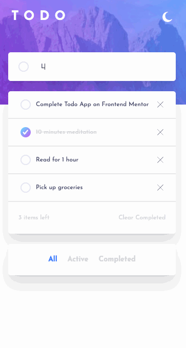

# Frontend Mentor - Todo app solution

This is a solution to the [Todo app challenge on Frontend Mentor](https://www.frontendmentor.io/challenges/todo-app-Su1_KokOW). Frontend Mentor challenges help you improve your coding skills by building realistic projects. 

## Table of contents

- [Overview](#overview)
  - [The challenge](#the-challenge)
  - [Screenshot](#screenshot)
  - [Links](#links)
- [My process](#my-process)
  - [Built with](#built-with)
  - [What I learned](#what-i-learned)
  - [Continued development](#continued-development)
  - [Useful resources](#useful-resources)
- [Author](#author)
- [Acknowledgments](#acknowledgments)


## Overview

### The challenge

Users should be able to:

- View the optimal layout for the app depending on their device's screen size
- See hover states for all interactive elements on the page
- Add new todos to the list
- Mark todos as complete
- Delete todos from the list
- Filter by all/active/complete todos
- Clear all completed todos
- Toggle light and dark mode
- **Bonus**: Drag and drop to reorder items on the list

### Screenshot




### Links

- Solution URL: [GitHub](https://github.com/jakegodsall/todo-web-app)
- Live Site URL: [Netlify](https://jakegodsall-todo-app.netlify.app/)

## My process

### Built with

- [React](https://reactjs.org/) - JS library
- [Next.js](https://nextjs.org/) - React framework
- [TailwindCSS](https://tailwindcss.com/) - CSS Library
- [Framer Motion](https://www.framer.com/motion/) - Animation Library
- [HTML Drag & Drop API](https://developer.mozilla.org/en-US/docs/Web/API/HTML_Drag_and_Drop_API) - API for creating drag and drop elements.

### What I learned

##### HTML Drag and Drop API

This is the first time I have tried to create a drag-and-drop style list. With the HTML Drag and Drop API it can be achieved in quite an intuitive way.

Simply define __draggable elements__ with `draggable="true"`, and define a drop zone by adding the `ondragover` and `ondrop` event handlers to the element.

For a list where every element is both a draggable event and a drop zone, however, this becomes a little more tricky, especially with state management. 

However, following [this](https://dev.to/florantara/creating-a-drag-and-drop-list-with-react-hooks-4c0i) tutorial I was able to create a nice looking drag-and-drop style list.

##### Using TailwindCSS effectively

This was a great challenge to really get to grips with using the TailwindCSS configuration file to make building applications with multiple style options more fluid and enjoyable. As an example,

```javascript
theme: {
    extend: {
        textColor: {
            primary: 'var(--color-text-primary)',
            secondary: 'var(--color-text-secondary)',
        },
    }
}
```

Adding these `primary` and `secondary` text colours using CSS custom properties in the `globals.css`, it was possible to in fact quickly style four different colours in the Tailwind styles, `text-primary`, `text-secondary`, `dark:text-primary` and `dark:text-secondary`, without needing to keep going back to the design files to find hex-codes.

### Continued development

Continuted development opportunities for this project would be to build it out as a full-stack CRUD application. I may in fact do so in the future if I am learning a new backend framework, as it is quite a nice frontend to work with.


### Useful resources

- [Creating a Drag and Drop List with React Hooks](
https://dev.to/florantara/creating-a-drag-and-drop-list-with-react-hooks-4c0i) - This helped me build out the drag-and-drop list that is a major feature of the application.

## Author

-   Website - [Jake Godsall](https://jakegodsall.com)
-   Frontend Mentor - [@jakegodsall](https://www.frontendmentor.io/profile/jakegodsall)
-   LinkedIn - [@godsalljake](https://www.linkedin.com/in/godsalljake/)

